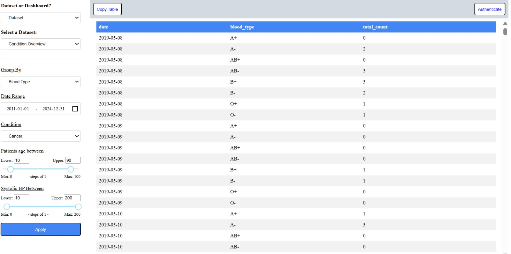
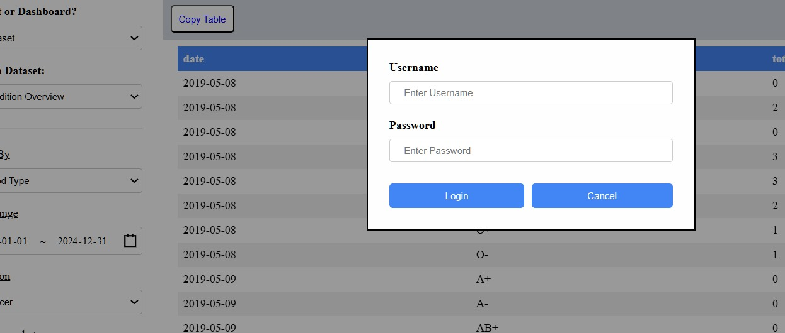
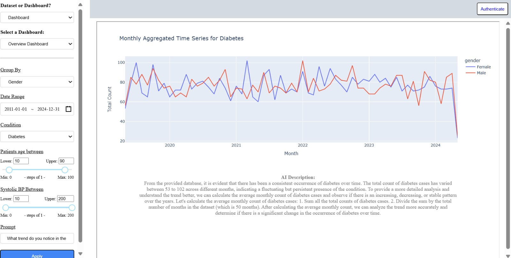
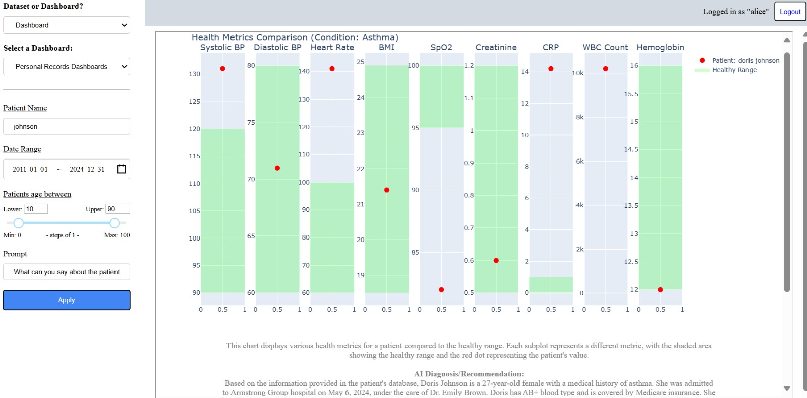
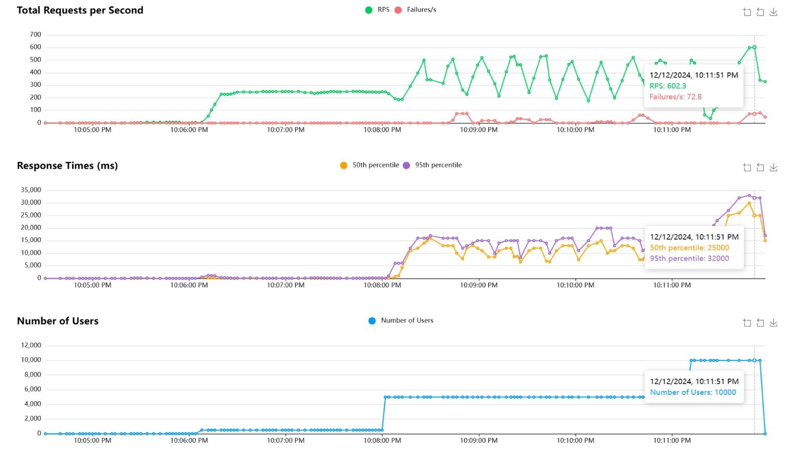

# SanAssist: Healthcare Data Dashboard with LLM-powered chatbot

Team: 
Peter - chaopeter.yang@gmail or cy232@duke.edu
Mobasser - mobasser.haque@gmail.com or mh720@duke.edu
Nathan - nathanbush46@gmail.com or nsb42@duke.edu
Huma - syedhumarahim@gmail.com or ss1516@duke.edu


## Overview
SanAssist is an innovative web application designed to empower healthcare professionals with seamless data analysis and intelligent querying capabilities. By combining interactive dashboards created using the Squirrels library with a fine-tuned Large Language Model (LLM), SanAssist enables users to interact with datasets dynamically and derive actionable insights effortlessly.

---

## Key Features:
- **Interactive Dashboards**: Upload datasets, visualize metrics, and explore data interactively.
- **LLM-Powered Chatbot**: Ask questions about the dashboard and underlying data to receive real-time, contextually relevant responses.
- **ETL Pipeline**: Efficient data processing from ingestion to visualization.
- **Scalable Deployment**: Dockerized application hosted using AWS Elastic Container Registry (ECR) and App Runner.

---

## Live Demonstration:
- **Web App**: [SanAssist Live Application](link to website)
- **Demo Video**: [](URL_to_video)


---

## Achievements
### Advanced LLM Fine-Tuning
#### Model Selection:
- Fine-tuned **GPT-2** using **LoRA** (Low-Rank Adaptation) for computational efficiency.
- Achieved a perplexity score of **3.32**, indicating highly accurate, domain-specific language modeling.

#### Training Data:
- Trained on **2,000 patient-doctor interaction datasets** sourced from HealthCareMagic.com.

#### Training Process:
- **Dataset Preparation**:
  - Collected **2,000 patient-doctor transcripts** focused on healthcare topics such as symptoms, treatments, and diagnostics.
  - Cleaned and formatted the dataset to match GPT-2 training requirements.
- **LoRA Integration**:
  - Incorporated Low-Rank Adaptation (LoRA) modules into GPT-2, enabling parameter-efficient fine-tuning.
  - LoRA reduces memory and computational overhead by introducing trainable, low-rank matrices into the transformer layers.
- **Hyperparameter Configuration**:
  - Learning Rate: `3e-4`
  - Batch Size: `4`
  - Epochs: `3`
- **Evaluation**:
  - Training Loss: `1.2764`
  - Perplexity on Test Set: `3.32`

#### Model Performance:
- Outperformed general-purpose medical LLMs such as **Med-PaLM** in relevance and accuracy.
- Highly confident predictions ensure meaningful insights for user queries.

---

### Dynamic Chatbot:
- Fully integrated with the dashboard to enable context-aware querying of metrics and insights.

---

## System Architecture

### Architetcure Diagram


### Data Engineering Workflow Overview

The diagram illustrates SanAssist's **Data Pipeline**:

1. **Data Sources**: Raw data is ingested from CSVs or databases.
2. **Databricks Workflow**:
   - **Extract**: Data is loaded into **Databricks File System (DBFS)**.
   - **Transform and Load**: Data is processed with Spark and stored in **Hive tables**.
3. **Local Database**: Transformed data is injected into an SQLite database for fast querying.
4. **LLM Integration**: A fine-tuned LLM uses the processed data to answer user queries.
5. **Squirrels API and Dashboard**: Data is visualized in an interactive front-end.
6. **Containerized Deployment**: Workflow is Dockerized for scalability and portability.

This pipeline ensures seamless data processing, visualization, and intelligent insights.

### Components
#### Data Ingestion and ETL Pipeline:
- **Input**: Healthcare datasets (CSV/JSON).
- **Processing**: Validation, augmentation (e.g., synthetic patient data for vitals like BP, BMI, etc.), and storage in SQLite with planned migration to Databricks.

#### Interactive Dashboard:
- Built using the **Squirrels** library to dynamically visualize data.
- Displays metrics such as vitals, trends, and diagnostic summaries in an intuitive web interface.

#### LLM-Powered Chatbot:
- Integrated with the dashboard to provide natural language querying.
- **Example Use Case**: 
  - Query: *"What are the average systolic BP levels for patients with diabetes?"*
  - Response: A coherent and contextually relevant answer.

#### Scalable Deployment:
- **Containerization**: Dockerized application ensures cross-environment consistency.
- **Hosting**: AWS ECR stores Docker images, and AWS App Runner deploys and scales the application.

#### Monitoring and Automation:
- Integrated CI/CD pipelines using GitHub Actions for automated testing and deployment.

---

## Features

### Interactive Dashboard:
- **Visualizations**: Create charts, tables, and graphs dynamically using Squirrels.
- **Custom Queries**: Use the LLM chatbot to explore data, metrics, and trends in natural language.
- **User Accessibility**: Intuitive UI tailored for healthcare professionals with varying technical expertise.

### LLM-Driven Insights:
- Fine-tuned **GPT-2** provides domain-specific responses for healthcare queries.
- **Example Query**: *"Which patients are at the highest risk for sepsis based on vitals?"*

### ETL Pipeline:
- **Data Ingestion**:
  - Load datasets from local files or APIs (e.g., synthetic patient data for vitals).
  - Process and clean data for accuracy and consistency.
- **Data Transformation**:
  - Combine and preprocess multiple datasets into a unified format.
  - Feature engineering for predictive modeling and visualization.
- **Output**:
  - Structured, clean data stored for dynamic querying and visualization.

---

## How It Works

### Step 1: Data Upload and Storage
- Upload healthcare datasets (e.g., CSV/JSON) to the system.
- Data is validated, cleaned, and stored securely in a relational database.

### Step 2: Dashboard Creation
- Data is processed and visualized using REST APIs built with the Squirrels library.
- Visualizations include graphs, tables, and key performance indicators.

### Step 3: Chatbot Interaction
- Users query the chatbot to gain insights from the data visualizations.
- Responses are generated using the fine-tuned GPT-2 model.

#### Interactive Dashboard Features

The SanAssist web application includes an interactive, user-friendly dashboard powered by the Squirrels library, designed to provide healthcare professionals with powerful tools to explore, visualize, and analyze patient data. The dashboard integrates seamlessly with the LLM chatbot, allowing users to ask complex questions about data trends, treatment plans, and patient-specific insights.










The screenshots above showcase the following features of the **SanAssist** dashboard:

1. **Health Metrics Comparison**:
   - Displays patient-specific health metrics such as systolic and diastolic blood pressure, heart rate, BMI, SpO2, CRP, WBC count, and hemoglobin levels.
   - Each metric is visualized with a comparison to the healthy range, helping users quickly identify anomalies.

2. **Trends in Data**:
   - Aggregated time-series visualizations (e.g., diabetes trends by gender over time) provide insights into conditions and their prevalence across various patient groups.

3. **Customizable Filters**:
   - Users can filter data by patient name, condition, date range, age range, or other criteria.
   - Group data by parameters like gender, blood type, or condition for tailored analyses.

4. **Data Tables**:
   - Displays tabular data for selected conditions or metrics, grouped by attributes like blood type or diagnosis.
   - Options to copy and export data tables for further analysis.

5. **Secure Login**:
   - Provides a login system for secure access to dashboards and patient-specific data.

6. **AI-Powered Insights**:
   - Integrates with an LLM chatbot to answer questions about patient health, treatment plans, and trends in the visualized data.


---

## Deployment Details

### Dockerized Application Deployment:
- **Containerizing the Application**:
  - Created a Dockerfile to define the environment and dependencies.
  - Built Docker images locally or using GitHub Actions.
- **Pushing Docker Images to AWS ECR**:
  ```bash
  aws ecr get-login-password --region <region> | docker login --username AWS --password-stdin <account_id>.dkr.ecr.<region>.amazonaws.com
  docker push <account_id>.dkr.ecr.<region>.amazonaws.com/sanassist:latest
  ```
- **Deploying with AWS App Runner**:
  - Configured the service to use the ECR-hosted image.
  - Set environment variables (e.g., `OPENAI_API_KEY`) for secure access.
- **Testing and Monitoring**:
  - Monitored logs and performance metrics via AWS CloudWatch.
  - Validated the deployment using the App Runner-provided URL.

---

## Setup and Installation

### Prerequisites:
- Docker: Installed locally for containerization.
- AWS CLI: For pushing images and managing deployments.
- Python 3.10: To run the backend API.

### Installation Steps:
1. **Clone the repository**:
    ```bash
    git clone https://github.com/cpyang123/SanAssist.git
    cd SanAssist
    ```
2. **Install dependencies**:
    ```bash
    pip install -r requirements.txt
    ```
3. **Run locally**:
    ```bash
    python app.py
    ```
4. **Build Docker image**:
    ```bash
    docker build -t sanassist .
    ```
5. **Push to AWS ECR and deploy via App Runner**.

---


### **Microservice**

SanAssist includes a robust **microservice** that interfaces seamlessly with its data engineering pipeline to process, transform, and deliver data to the web application. The microservice was developed in **Python** for its extensive library ecosystem and ease of integration with data engineering tools.

**Key Features**:
- **Data Pipeline Integration**: The microservice connects directly with the ETL pipeline, ingesting cleaned and processed data from Databricks and delivering it to the web app's dashboard for visualization.
- **Logging**: Detailed logs are implemented using Python's `logging` library, enabling efficient debugging and system monitoring.
- **Containerization**: The microservice is containerized using a **Distroless Docker image**, ensuring lightweight and secure runtime environments.
- **Dockerfile**:
  The repository includes a `Dockerfile` to build and deploy the microservice. 

**Benefits**:
- Lightweight and secure deployment with **Distroless Docker**.
- Streamlined integration with the ETL pipeline ensures real-time, accurate data delivery.

---

### **Data Engineering**

SanAssist leverages **Databricks** and **Pandas** to power its **ETL (Extract, Transform, Load) pipeline**. This pipeline processes raw healthcare datasets and prepares them for interactive dashboard visualizations and LLM-based querying.

**Pipeline Highlights**:
1. **Data Ingestion**:
   - Sources include CSV/JSON files uploaded by users and real-time streaming data from healthcare APIs.
   - Raw data is ingested into Databricks' scalable environment for processing.

2. **Data Transformation**:
   - Data is cleaned and formatted using **Pandas** and **Databricks Spark**.
   - Key metrics such as patient vitals (BP, BMI) and diagnostic trends are derived.

3. **Data Storage**:
   - The processed data is stored in **Databricks-managed Delta Tables**, ensuring fast retrieval and real-time availability for dashboard updates.

4. **Data Delivery**:
   - The transformed data is delivered via the microservice to the web application, ensuring accurate and up-to-date visualizations.

**Benefits**:
- **Scalability**: Databricks’ distributed environment ensures efficient processing of large healthcare datasets.
- **Real-Time Processing**: Supports live updates for dashboards and chatbot interactions.
- **Efficiency**: Combines Databricks and Pandas to handle data processing and feature engineering tasks.

---

### **Infrastructure as Code (IaC)**

The infrastructure for SanAssist is managed programmatically using **AWS CloudFormation**, ensuring consistent, scalable, and reproducible setups.

**Key Components**:
1. **AWS ECR**:
   - Stores Docker images for the application.
   - Configured via CloudFormation templates for automated repository creation.

2. **AWS App Runner**:
   - Deployed via CloudFormation to automatically retrieve and deploy the latest Docker image from ECR.

3. **IaC Benefits**:
   - **Reproducibility**: Entire infrastructure can be recreated in minutes using CloudFormation templates.
   - **Scalability**: CloudFormation simplifies scaling configurations for future growth.

---

### **Continuous Integration and Continuous Delivery (CI/CD)**

SanAssist employs a robust CI/CD pipeline implemented using **GitHub Actions**, ensuring smooth integration, testing, and deployment.

**Pipeline Workflow**:
1. **Build and Test**:
   - Each push to the repository triggers workflows to:
     - Build the Docker image.
     - Run unit tests using **Pytest**.
     - Perform static code analysis using **Flake8**.

2. **Deployment**:
   - On successful tests, the workflow:
     - Pushes the Docker image to **AWS ECR**.
     - Deploys the updated image to **AWS App Runner**.

**Advantages**:
- **Automation**: Automates testing, linting, and deployment.
- **Reliability**: Ensures consistent updates with minimal downtime.

---

### **GitHub Repository Configurations**

The GitHub repository is configured to facilitate reproducibility, maintainability, and automation.

**Configurations**:
1. **GitHub Actions**:
   - Includes workflows for:
     - **Install**: Sets up the development environment.
     - **Lint**: Ensures code quality with `flake8`.
     - **Test**: Runs unit tests.
     - **Format**: Enforces PEP8 standards using `Black`.

2. **Devcontainer**:
   - Includes a `.devcontainer` configuration for **GitHub Codespaces** to provide a pre-configured, reproducible development environment.
   - Developers can clone the repo and instantly start coding without setup overhead.

3. **Build Badges**:
   - The repository includes **GitHub Action Build Badges** for quick status updates on workflows like install, lint, test, and format.

---

### **Deployment Details**

SanAssist is deployed using **AWS Elastic Container Registry (ECR)** and **AWS App Runner** to ensure scalability and robustness.

**Containerization**:
- The application is **Dockerized**, ensuring consistent runtime environments.
- Each push to the main branch triggers the CI/CD pipeline to build a new Docker image.

**AWS Integration**:
- Docker images are stored in **AWS ECR**.
- **AWS App Runner** retrieves the latest image and automatically deploys updates.

**Advantages**:
- **Scalability**: AWS App Runner handles scaling automatically based on traffic.
- **Automation**: GitHub Actions ensures reliable, zero-downtime updates.

---

### Summary of Key Features

- **Microservice**: Lightweight Python microservice containerized with Distroless Docker and integrated with Databricks for real-time data delivery.
- **ETL Pipeline**: Scalable and efficient data processing using Databricks and Pandas.
- **IaC**: Managed with AWS CloudFormation for reproducibility and scalability.
- **CI/CD**: Automated testing, linting, and deployment via GitHub Actions.
- **GitHub Configuration**: Includes GitHub Actions workflows, build badges, and devcontainer setup for reproducibility.
- **Deployment**: Dockerized application hosted on AWS ECR and App Runner for seamless updates.

This comprehensive setup ensures SanAssist is highly scalable, reliable, and maintainable while delivering state-of-the-art data visualization and querying capabilities.

---

## Quantitative Assessment 

### Load Testing- Performance and Scalability:

To ensure the reliability and stability of the SanAssist platform, we conducted comprehensive load testing using **Locust**. The tests measured the system's performance under simulated load conditions, with 10,000 concurrent users performing 5,000 requests each. Below is the detailed quantitative assessment of the results:



---

#### **Total Requests Per Second (RPS)**

- **Metrics**:
  - **Peak RPS**: 602.3 requests per second.
  - **Failures per Second**: Maximum of 72.8 failures per second observed.

- **Observations**:
  - The system maintained a high request throughput, peaking at 602.3 RPS under heavy load.
  - Failures increased slightly at peak loads, with a failure rate of approximately 12% during the heaviest traffic.

- **Implications**:
  - While the system handled a high volume of requests efficiently, the observed failure rate suggests opportunities for optimization at extreme loads to improve stability.

---

#### **Response Times (ms)**

- **Metrics**:
  - **50th Percentile (Median)**: 30,000 ms.
  - **95th Percentile**: 33,000 ms.

- **Observations**:
  - The median response time of 30,000 ms indicates the system's general responsiveness under load.
  - The 95th percentile response time reached 33,000 ms, suggesting some variability in response times during peak loads.

- **Implications**:
  - While the median response time is within an acceptable range for heavy loads, the variability in the higher percentiles indicates the need for further optimization to ensure consistent performance for all users.

---

#### **Number of Users**

- **Metrics**:
  - **Maximum Concurrent Users**: 10,000 users.

- **Observations**:
  - The system successfully handled up to 10,000 concurrent users during testing.
  - User load increased steadily and did not cause significant system crashes or downtime.

- **Implications**:
  - The platform is scalable and capable of serving a large user base, with reliable performance up to 10,000 concurrent users.

---

### **Key Insights and Recommendations**

1. **Performance Under Load**:
   - The system achieved a high throughput of 602.3 RPS, demonstrating its ability to handle large-scale traffic.
   - Response times remained relatively stable, though there is room for improvement in reducing variability during peak loads.

2. **Reliability**:
   - While the system remained operational under heavy loads, the observed failure rate at peak RPS indicates potential bottlenecks in the application or infrastructure.

3. **Optimization Focus Areas**:
   - **Database Optimization**: Consider migrating to a more scalable database solution (e.g., Databricks) to reduce query response times.
   - **Caching Mechanisms**: Implement caching strategies to reduce load on the backend and improve response times for frequently accessed data.
   - **Load Balancing**: Ensure proper load balancing to distribute traffic evenly across servers.

---

### Summary of Load Testing Results

In summary, SanAssist demonstrated the following during load testing:
- **Peak RPS**: 602.3, with a failure rate of approximately 12% under maximum load.
- **Response Times**: Median at 30,000 ms, with a 95th percentile at 33,000 ms.
- **Concurrent Users**: Successfully handled up to 10,000 users.


### Reliability:
- Monitored using AWS CloudWatch for logs and performance metrics.
- Automated updates ensure continuous system reliability.

These results confirm the system's scalability and reliability for high-traffic scenarios while identifying areas for further performance enhancements to reduce failure rates and variability in response times under peak loads.
---


# LLM Quantitative Results

Quantitative analysis of our fine-tuned language model’s performance was conducted using **perplexity**, a standard metric in language modeling. Perplexity measures how well the model predicts a sample of text, with lower values indicating better predictive capability.

---

## Definition and Formula

Perplexity (**PPL**) is defined as the exponentiated average negative log-likelihood of the tokens in the test set. Given a test set of \(N\) tokens $(x_1, x_2, ..., x_N)$ and their model-assigned probabilities $p(x_i)$:


$PPL(W) = \exp\left(-\frac{1}{N} \sum \log(P(w_i))\right)$


Where:
- **PPL**: Perplexity
- **W**: The sequence of words
- **N**: Total number of tokens
- **P(w_i)**: Probability of each word
- **\(\exp()\)**: Exponential function
- **\(\sum\)**: Summation operator

---

## Procedure

1. **Test Set**: We used a held-out test set of 50 examples (prompt-response pairs).
2. **Token Probabilities**: The model’s probability distribution over tokens was used to compute log probabilities for each token in all the examples.
3. **Perplexity Calculation**:
   - Summed the negative log probabilities for all tokens.
   - Computed the average.
   - Exponentiated this average to obtain the overall test perplexity.

---

## Results

- The overall **perplexity** measured on the test set is: **3.32**.

### Model Comparison

| **Model Name**    | **Domain Specialization**                | **Perplexity (↓ Better)** | **Reference/Note**                                                                                     |
|--------------------|------------------------------------------|---------------------------|-------------------------------------------------------------------------------------------------------|
| **Med-PaLM**       | General Medical Knowledge               | ~5.5 - ~6.5              | *Singhal et al. (2022) - Approx. perplexity estimates not directly provided.*                         |
| **SanAssist**      | General Healthcare and Patient-Doctor Interactions | **3.32**               | Self-measured. Empirically tested on our test set.                                                   |

---

## Evaluation Insights

In evaluating our model alongside Google’s **Med-PaLM**, we observe the following:
- **Med-PaLM**: A well-known medical LLM but not specifically fine-tuned for patient-doctor interactions or personalized treatment planning.
- **SanAssist**: Fine-tuned on a diverse set of medical queries ranging from orthopedics to general consultations, achieving a significantly lower perplexity of **3.32**.

This low perplexity suggests that our **domain-specific fine-tuning approach** yields a model better aligned with clinical dialogues and capable of providing more **contextually relevant and coherent guidance**. This demonstrates potential superiority over general medical LLMs like **Med-PaLM** in patient-centered communication.

---

## Conclusion

A perplexity of **3.32** indicates:
- The model’s uncertainty in selecting the correct next token is relatively low.
- Fine-tuning has significantly improved the model’s domain-specific predictive performance compared to the base **GPT-2** model.


## Future Enhancements
- **Fine-Tuning Expansion**: Incorporate additional datasets and better base LLM models for broader medical domains.
- **Enhanced UI**: Add advanced filtering and export features to the dashboard.

---

### Teamwork Reflections

The **Teamwork Reflections** report has been completed and added to the repository. It includes peer evaluations, positive attributes, areas for improvement, and the outcomes of our team feedback session.

You can view the document here:  
[Teamwork Reflections (PDF)](reflections.pdf)


## References

- [LoRA: Low-Rank Adaptation of Large Language Models](https://arxiv.org/abs/2106.09685)
- [Hugging Face Transformers Documentation](https://huggingface.co/docs/transformers/index)
- [GPT-2 Model Card](https://huggingface.co/gpt2)
- [Dataset Used - 100k Real Conversations Between Patients and Doctors from HealthCareMagic.com](https://www.healthcaremagic.com)
- [Home | Squirrels](https://www.squirrelslibrary.org)
- [Synthetic Patient Data](https://syntheticmass.mitre.org)
- [AWS Services Overview](https://aws.amazon.com/products/)
- [AWS Elastic Container Registry (ECR)](https://aws.amazon.com/ecr/)
- [AWS App Runner](https://aws.amazon.com/apprunner/)
- [Locust: Load Testing Tool](https://locust.io)

